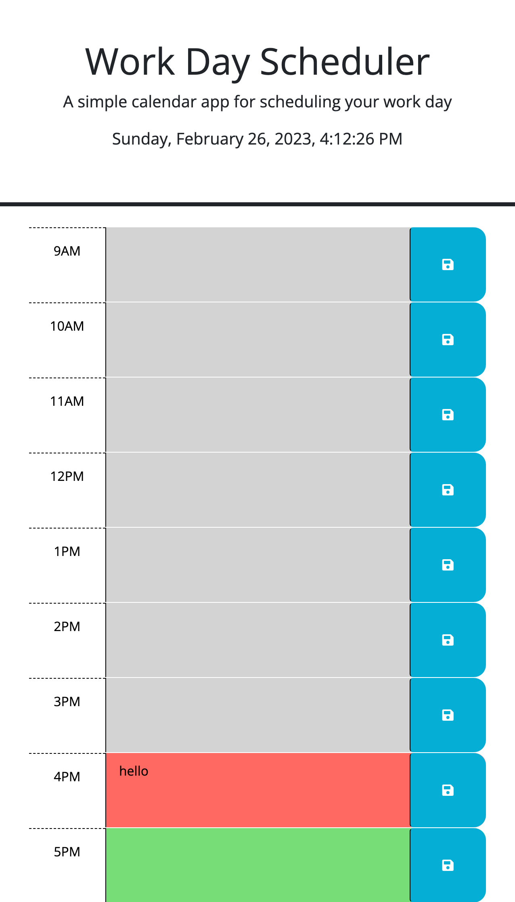

# Challenge-Five

## Description

- This project was to make a day scheduler, with functionality to save the tasks in time-slots. Color-coding is added to the time-blocks as well that signifies past/present/future.
- Learned functions within script a little better, got a bit more comfortable with JSON and the local storage. Learned how to attach current incremental time-display into an app.

## Usage

To use app:

- Go to time-slot and click on the empty box area in middle to add text,
- Once text is added within given space, click on the save button on the right to keep text within block. Can check to see what is saved within dev tools application portion local storage.

    
   

